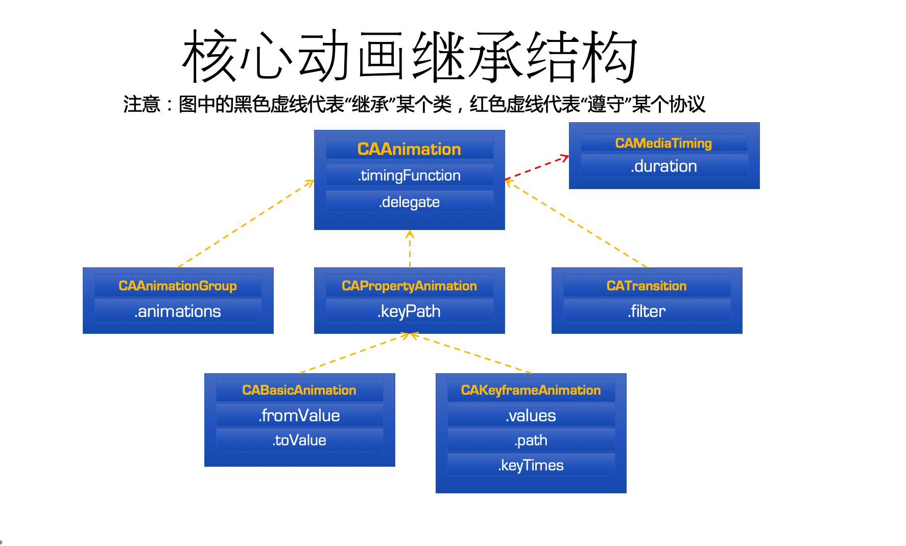
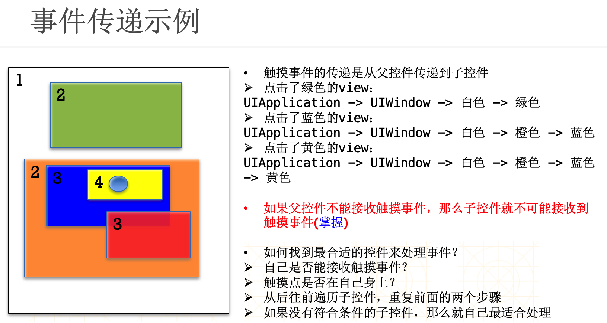
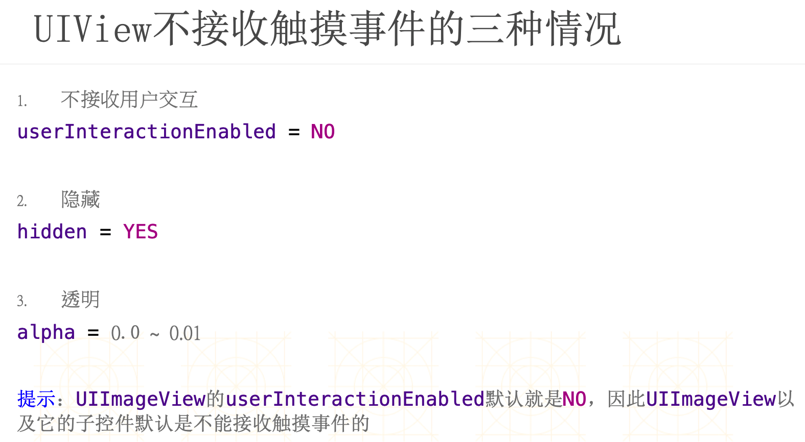

# OCTemplate

## publish
```bash
cd $HOME/git_repository/OCTemplate/OCTemplatePublish/src && node ./publish.js
```

---

## 每次OCTemplate有改动 , 其他使用这个库的项目 都得 先删除 再重新install, 蛋疼...
## 如果使用 tag 管理, 只要切换版本就可以, 给力...
```ruby
# Uncomment the next line to define a global platform for your project
platform :ios, '9.0'

target 'SNTest' do
  # Uncomment the next line if you're using Swift or would like to use dynamic frameworks
  # use_frameworks!
  # pod 'SNFramework', :git => 'https://github.com/stone-info/OCTemplate.git'
  # Pods for SNTest
  pod 'OCTemplate', :git => 'https://github.com/stone-info/OCTemplate.git',:tag => '0.0.6'
end
```


## Push私有模块工程
## commit整个工程代码
## 打上tag 0.0.1（下节会使用到）
## push到远程私有仓库（Coding）

```bash
git add .
git commit -m "add repo"
git tag 0.0.1
git push --tags
```


## 库工程的版本更新
因为Framework在开发的过程中会不断的更新，从0.0.1到 0.0.2等。

- 此时我们先更新代码，并打上tag，推送到远程仓库
```bash
git add .
git commit -m "update repo"
git tag 0.0.2
git push --tags
```

- 然后修改podspec文件中的version字段
```bash
s.version      = "0.0.2"
```

- 本地验证podspec文件
```bash
pod lib lint
或
pod spec lint
```


- 更新podspec文件到远程仓库
```bash
git add PrivatePodTest.podspec
git commit -m "update podspec"
git push
```

- 删除tag

```bash
git tag -d <tagname>
git push origin :refs/tags/<tagname>
```

---

## 增加心新的类的时候 不要忘记到 BuildPhases Headers 中 把文件加入到 pulic中

---

## iOS 详细解释@property和@synthesize关键字 
https://www.cnblogs.com/QM80/p/3576282.html

## iOS 开发中的争议（一）

打算分享一些有争议的话题，并且表达一下我的看法。这是该系列的第一篇，我想讨论的是：类的成员变量应该如何定义？

在 Objective-C 的语言的早期，类的私有成员变量是只能定义在 .h 的头文件里面的。像如下这样：

```objectivec
@interface ViewController : UIViewController {
    @private
    NSInteger _value;
}
```
之后，苹果改进了 Objective-C，允许在 .m 里面添加一个特殊的匿名 Category，即没有名字的 Category，来实现增加类的成员变量。像如下这样：

```objectivec
@interface ViewController ()
@property (nonatomic) NSInteger value;
@end
```
这样的好处是，这些变量在头文件中被彻底隐藏起来了，不用暴露给使用者。

接着，在 2013 年的 WWDC 中，苹果进一步改进了 Objective-C，允许在 .m 的
@implementation 中直接添加类的私有成员变量。像如下这样：

```objectivec
@implementation ViewController {
    NSInteger _value;
}
```
于是，大家对于如何定义私有的成员变量上就产生的分歧。许多人喜欢用匿名的 Category 的方式来定义私有成员变量。但是，我个人更推荐在 @implementation 中直接添加类的私有成员变量。下面我做一些解释。


---

## animation




---


## 转场动画过度效果

| 类型字符串 | 效果说明 | 关键字 | 方向 |
| :------:  | :------: | :------: | :------: |
| fade    |   交叉淡化过渡 |  YES  |
| push    |   新视图把旧视图推出去 |  YES  |
| moveIn    |   新视图移到旧视图上面 |  YES  |
| reveal    |   将旧视图移开,显示下面的新视图  |  YES  |
| cube    |  立方体翻滚效果 |
| oglFlip    |  上下左右翻转效果 |
| suckEffect    |  收缩效果，如一块布被抽走 |  | NO|
| rippleEffect    |  水滴效果 |  | NO|
| pageCurl    |  向上翻页效果 |  | |
| pageUnCurl    |  向下翻页效果 |  | |
| cameraIrisHollowOpen    |  相机镜头打开效果 |  | NO |
| cameraIrisHollowClose    |  相机镜头关闭效果 |  | NO |

---

## view.layer.shouldRasterize = YES(光栅化)的使用 及图片性能整理
https://blog.csdn.net/lg767201403/article/details/50960909

---

## UIEvent详解:远程控制,运动控制和触摸事件

UIEvent对象代表一个事件。在iOS中，主要有三种事件：触摸事件，运动事件，远程控制事件。远程控制事件主要是外部辅助设备或者耳机的远程命令，例如控制音乐声音的大小，或者下一首歌。运动事件主要是晃动设备等。

触摸事件包括一个或者多个触摸(touches), 每个触摸有一个UITouch对象表示。当触摸事件发生时，系统会通过触摸处理的逻辑找到合适的responder并把UIEvent对象传递过去。responder通过touchesBegan:withEvent:等方法去接收UIEvent对象。

**UIResponser都能接收事件,系统提供了几个方法接收UIEvent**

```objectivec
    //触摸
    override func touchesBegan(touches: NSSet, withEvent event: UIEvent) {
    }
    
    override func touchesMoved(touches: NSSet, withEvent event: UIEvent) {
    }
    
    override func touchesEnded(touches: NSSet, withEvent event: UIEvent) {
    }
    //摇晃相关
    override func motionBegan(motion: UIEventSubtype, withEvent event: UIEvent) {
    }
    
    override func motionEnded(motion: UIEventSubtype, withEvent event: UIEvent) {
    }
    
    override func motionCancelled(motion: UIEventSubtype, withEvent event: UIEvent) {
    }
    
    //远程控制相关
    override func remoteControlReceivedWithEvent(event: UIEvent) {
    }
```

**获得事件的触摸**

```objectivec
//所有的触摸
let allTouches = event.allTouches()
//获得UIView的触摸
event.touchesForView(self.view)
//获得UIWindow的触摸
event.touchesForWindow(self.view.window!)
```

**事件的时间戳**
```objectivec
//事件的时间戳
event.timestamp
```

**事件中特定手势的触摸**
```objectivec
let gesture = UITapGestureRecognizer(target: self, action: "Tap")
event.touchesForGestureRecognizer(gesture)
```

**三种事件类型**
```objectivec
UIEventTypeTouches
UIEventTypeMotion
UIEventTypeRemoteControl
```

**事件亚类型**
```objectivec
UIEventSubtypeNone                              = 0,//触摸事件的亚类型
        
UIEventSubtypeMotionShake                       = 1,//摇晃
        
UIEventSubtypeRemoteControlPlay                 = 100,//播放
UIEventSubtypeRemoteControlPause                = 101,//暂停
UIEventSubtypeRemoteControlStop                 = 102,//停止
UIEventSubtypeRemoteControlTogglePlayPause      = 103,//播放和暂停切换
UIEventSubtypeRemoteControlNextTrack            = 104,//下一首
UIEventSubtypeRemoteControlPreviousTrack        = 105,//上一首
UIEventSubtypeRemoteControlBeginSeekingBackward = 106,//开始后退
UIEventSubtypeRemoteControlEndSeekingBackward   = 107,//结束后退
UIEventSubtypeRemoteControlBeginSeekingForward  = 108,//开始快进
UIEventSubtypeRemoteControlEndSeekingForward    = 109,//结束快进
```


---

## 事件传递




---

## hitTest , 手动添加的手势 , 不起作用 , 大坑, 如果子view 脱离 父view的范围...
使用UIButton 能解决这个问题...  
好像是 injected 搞的鬼 - - , 还得测试...

---

## 解决NSTimer/CADisplayLink的循环引用
https://www.jianshu.com/p/5068b6f02238

---

## iOS开发UI篇--仿射变换(CGAffineTransform)使用小结
http://www.imooc.com/article/265329?block_id=tuijian_wz
## CGAffineTransform 简单分析
http://xummer26.com/blog/CGAffineTransform-simple-analysis.html
## 线性代数...shit...